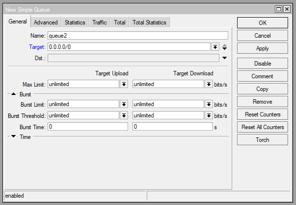
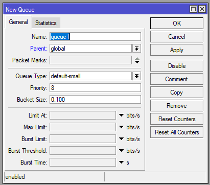

# LAB-28-BURST
Selasa 19 Agustus 2025  

# BURST
  Burst adalah salah satu fitur Mikrotik yang memungkinkan penggunaan data-rate yang melebihi max-limit untuk periode waktu tertentu. Burst dapat terjadi hanya jika data rate lebih kecil dari burst-threshold. Burst akan berhenti jika average-rate antrian untuk burst-time terakhir lebih besar atau sama dengan burst-threshold. Cara kerja dari burst yaitu pada saat client download, router akan melakukan perhitungan rata-rata penggunaan user dalam 16 detik terakhir. Jika hasil rata-rata masih kurang dari Burst Threshold maka client mendapatkan bonus sampai Burst Limit. Jika rata-rata sama atau lebih besar dari Burst Threshold maka client tidak boleh burst dan bandwidth akan di limit sesuai Max Limit.  
  Burst di Simple Queue  
    
  Burst di Queue Tree  
    
    
**3 parameter utama Burst**  
1. Burst Limit  
  Nilai Burst limit harus selalu lebih besar dari max limit, jika menentukan burst limit dibawah max limit maka tidak akan berfungsi.  
2. Burst Threshold  
  Digunakan untuk mengkalkulasi apakah client tersebut boleh naik hingga burst limit atau cukup hanya sampai max limit.  
3. Burst Time  
  Rentang waktu yang digunakan router untuk menghitung rata-rata, burst time ini tidak ada kaitannya dengan berapa lama client boleh melakukan burst.  
Contohnya seperti ini, max limit kita set di 8Mbps, jika tidak ada burst maka client akan sellau mendapat traffic 8Mbps.

# Kesimpulan
  Fitur Burst pada Mikrotik memungkinkan user mendapatkan bandwidth lebih tinggi dari max-limit untuk sementara waktu, selama average-rate dalam burst-time masih di bawah burst-threshold.

# Sumber
Youtube - Citraweb - https://www.youtube.com/watch?v=zGHRE3SI8PI
